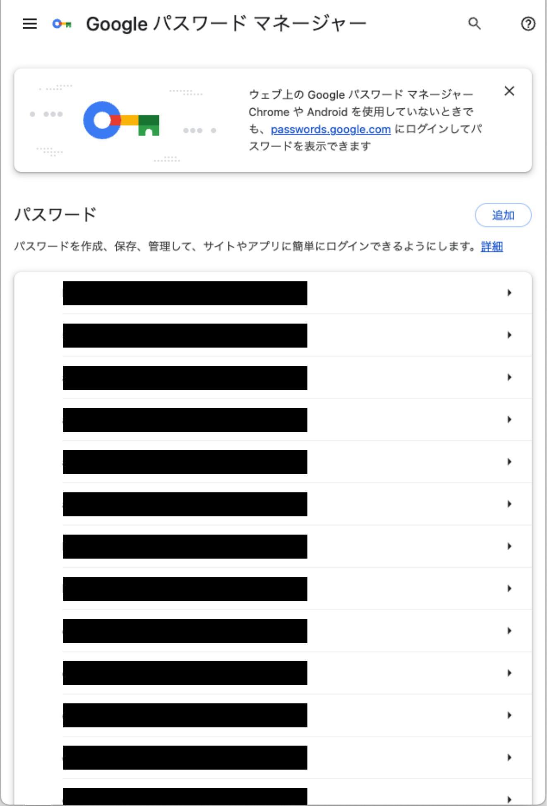
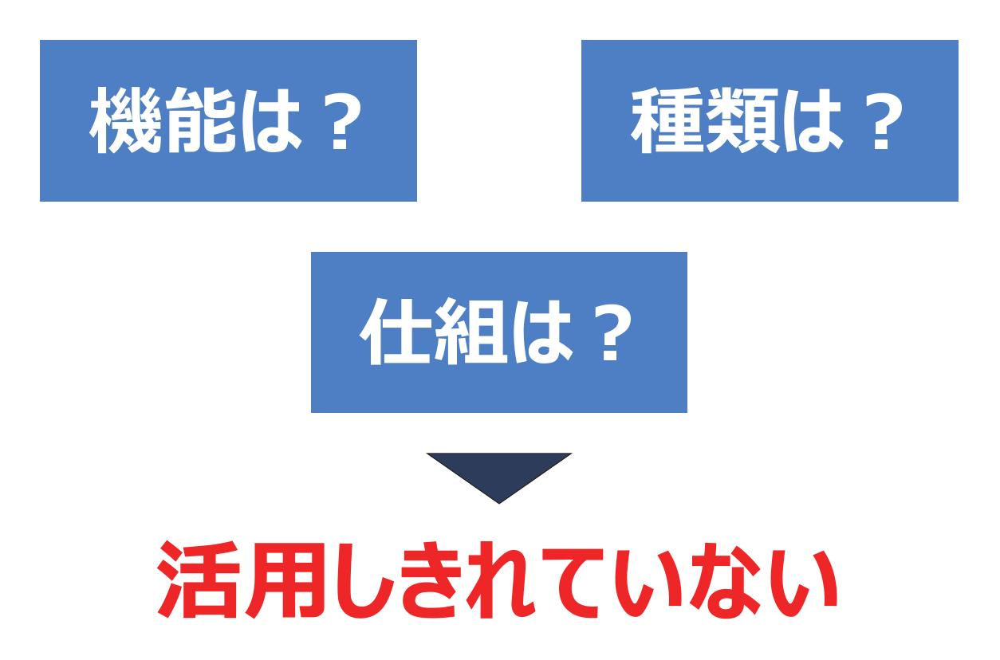
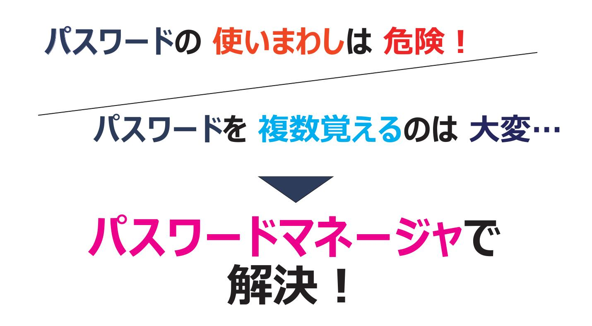
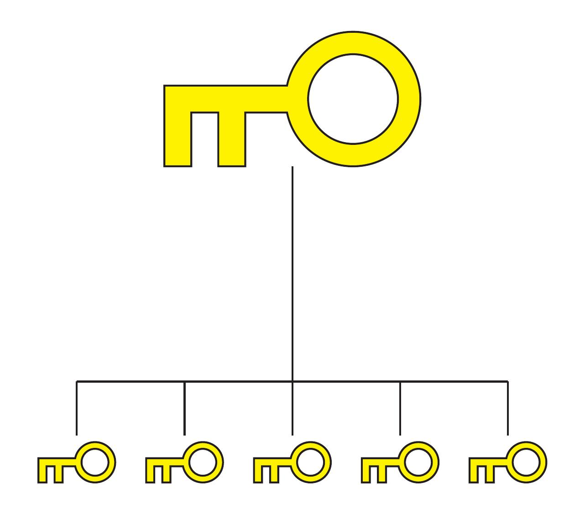
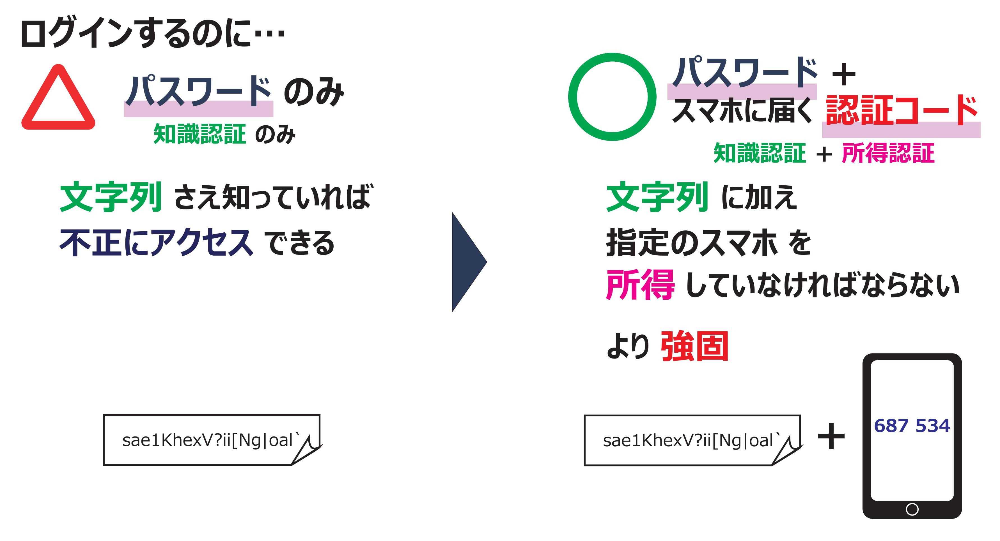
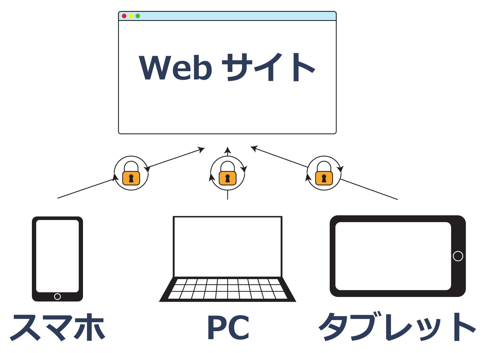

<!-- _class: title -->
# 「パスワードマネージャ」のすゝめ
<!--
header: "プレゼンテーション技法 2024/06/13"
footer: "慶應義塾大学理工学部物理情報工学科 渡辺研究室"
-->

---

<!--
header: ""
footer: ""
-->

# パスワードマネージャとは？

<h2 style="background:linear-gradient(transparent 60%, #fec1fe 0%);font-size:52px;">意識せず使っている人が多い</h2>

---

# ご存じですか？パスワードマネージャの・・・

---

# パスワードマネージャの有用性

---

# マスタパスワード

<h2 style="background:linear-gradient(transparent 60%, #fec1fe 0%);font-size:60px;" align="center">覚えるパスワードは</h2>
<h2 style="background:linear-gradient(transparent 60%, #fec1fe 0%);font-size:60px;" align="center">１つでいい</h2>

---

<h1 style="position:relative;top:-8%"> 多要素認証をかけてしっかり守れる </h1>

---

# 複数のデバイスから利用できる

<h2 style="background:linear-gradient(transparent 60%, #fec1fe 0%);font-size:60px;" align="center">ログインすれば</h2>
<h2 style="background:linear-gradient(transparent 60%, #fec1fe 0%);font-size:60px;" align="center">複数の端末から</h2>
<h2 style="background:linear-gradient(transparent 60%, #fec1fe 0%);font-size:60px;" align="center">利用できる</h2>

---

<!-- _class: title -->

<h1 style="position:relative;top:-100%">パスワードマネージャで パスワード を もっと <strong style="background:linear-gradient(transparent 50%, #ffd785 0%);">安全に</strong> <strong style="background:linear-gradient(transparent 60%, #fec1fe 0%);">楽に</strong> 管理しよう。</h1>